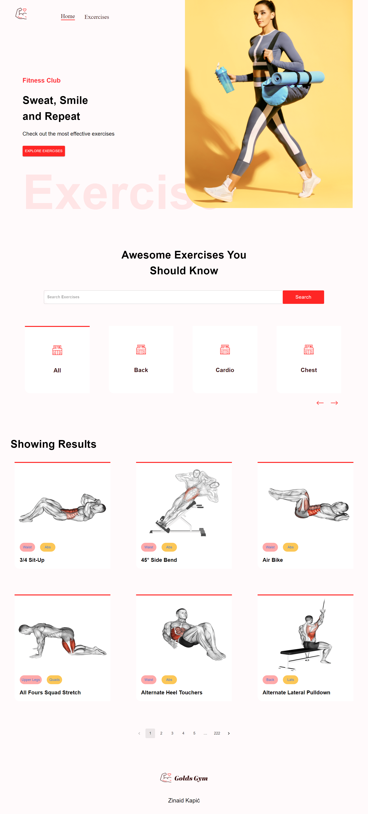

# React APP with API Consumption (Rapid API-Exercises and YouTube)

Created React.js app that uses Rapid API endpoints for Exercises and YouTube. In this project I have also learned Material UI for design. 

Home page and Exercise Detail page are presented on the following figures.

Tutorial for this project was provided by JavaScript Mastery.